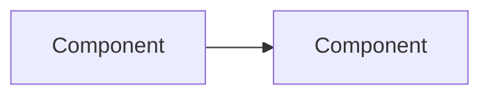

# Research Report Template

Copy and customize for each research report.

---

```markdown
# Research Report: [Topic]

**Date:** YYYY-MM-DD
**Scope:** [Brief description of research boundaries]

## Executive Summary

[2-3 paragraphs: key findings, main recommendations, critical caveats]

## Research Methodology

- **Sources consulted:** [number]
- **Date range:** [oldest to newest source]
- **Search terms:** [list key queries used]

## Key Findings

### 1. Technology Overview
[What it is, how it works, current version/state]

### 2. Current State & Trends
[Adoption, recent developments, community momentum]

### 3. Best Practices
[Recommended approaches with explanations]
- Practice 1: [description]
- Practice 2: [description]

### 4. Security Considerations
[Vulnerabilities, mitigations, security best practices]

### 5. Performance Insights
[Benchmarks, optimization techniques, trade-offs]

## Comparative Analysis

| Aspect | Option A | Option B | Option C |
|--------|----------|----------|----------|
| Pros | | | |
| Cons | | | |
| Use when | | | |

## Implementation Recommendations

### Quick Start
```language
// Minimal working example
```

### Architecture


### Common Pitfalls
1. **Pitfall:** [description] **Solution:** [fix]

## Code Patterns (for Planners)

### Pattern: [Name]
**Use when:** [scenario]
**Version:** [lib v1.2.3]
**Source:** [URL]

```language
// Latest approach (2025)
implementation code here
```

**Avoid (deprecated):**
```language
// Old approach - don't use
old code here
```

## Sources
- **Official:** [Title](URL)
- **Technical:** [Title](URL)
- **Community:** [Title](URL)

## Unresolved Questions
- [ ] Question 1

## Appendices
| Term | Definition | | Version | Compatible With |
|------|------------|---|---------|-----------------|
```

---

**Usage:** Delete unused sections. Keep summary <500 words. Cite every claim. Test code examples.
